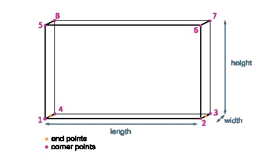

# pystruct3d

# Installation

The `-e` flag is used for development
`pip install -e .`

# Python version

3.10

# Dependencies

Numpy

Scipy

**For visualization only**

Open3D

# Bounding box naming convention

To avoid confusion, there is a naming convention for the dimensions and points of the bounding box: 

Note, that the length is always the longer horizontal dimension, width is the smaller horizontal dimension. The height is the dimension along the z-axis. 

The corner points are ordered in counter-clockwise order from bottom to the top. The end points are the points of the lower horizontal center line along the length of the bounding box. 

# ToDo table

- [ ] change points_in_BBox to points_in_bbox

| **module**                            | **name**              | **classes, methods and functions**     | **comments**              |
|---------------------------------------|-----------------------|----------------------------------------|---------------------------|
| modified PCA axis alignment           | pca_align             | - [ ] ...                              |                           |
| voxel-based density filtering         | vox_density_filtering | - [ ] ...                              |                           |
| level fitting                         | level_fitting         | - [ ] histogram                        |                           |
|                                       |                       | - [ ] find peaks                       |                           |
|                                       |                       | - [ ] ...                              |                           |
| bounding box                          | bbox                  | - [X] *class: bbox*                    |                           |
|                                       |                       | - [X] order_points                     |                           |
|                                       |                       | - [X] points_in_bbox                   |                           |
|                                       |                       | - [X] translate                        |                           |
|                                       |                       | - [X] translate_z                      |                           |
|                                       |                       | - [X] expand                           |                           |
|                                       |                       | - [X] lower_edges                      |                           |
|                                       |                       | - [X] length                           |                           |
|                                       |                       | - [X] width                            |                           |
|                                       |                       | - [X] height                           |                           |
|                                       |                       | - [X] angle                            |                           |
|                                       |                       | - [X] split_bounding_box               |                           |
|                                       |                       | - [X] axis_align                       |                           |
|                                       |                       | - [X] as_np_array                      |                           |
|                                       |                       | - [X] get_endpts                       |                           |
|                                       |                       | - [X] volume                           |                           |
|                                       |                       | - [X] fit_axis_aligned                 |                           |
|                                       |                       | - [X] fit_horizontal_aligned           |                           |
|                                       |                       | - [ ] fit_minimal                      |                           |
|                                       |                       | - [X] bbox_from_verts                  |                           |
|                                       |                       | - [ ] ...                              |                           |
| visualization                         | visualization         | - [ ] points_cloud_geometry            |                           |
|                                       |                       | - [ ] bbox_geometry                    |                           |
|                                       |                       | - [ ] plane_geometry                   |                           |
|                                       |                       | - [ ] visualize                        |                           |
| Evalutation and metrics               | metrics               | - [ ] bbox_iou                         | hungarian algorithm, ...  |
|                                       |                       | - [ ] volumetric_iou                   |                           |
|                                       |                       | - [ ] voxel_iou                        |                           |
|                                       |                       | - [ ] ...                              |                           |