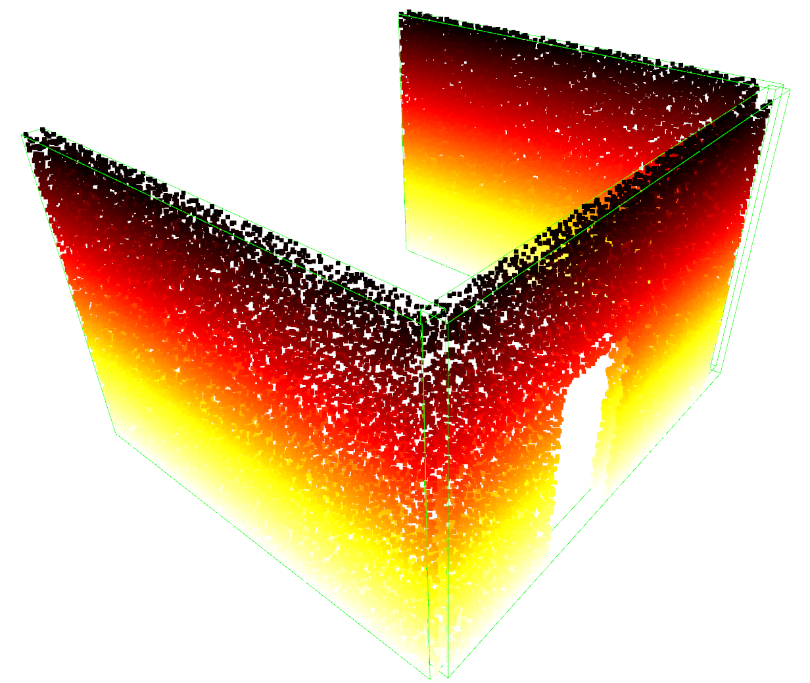
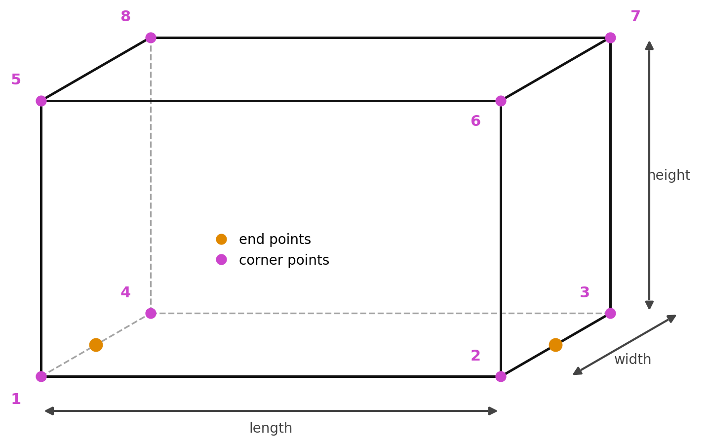

# PyStruct3D


[](https://opensource.org/licenses/MIT)
[](https://arxiv.org/abs/2604.24311)

PyStruct3D is an open-source Python library supporting scan-to-BIM workflows as part of the [BIMStruct3D](https://arxiv.org/abs/2604.24311) pipeline. It provides tools for fitting bounding geometry to segmented point cloud instances, evaluating reconstruction accuracy, and visualizing 3D structural elements. For accurate reconstruction it is advised to apply noise filtering to instance points beforehand, as reconstruction procedures may produce bounding geometry.



## Features

- **bbox**: Bounding box class with methods for fitting, manipulating, and querying box parameters from point clouds
- **metrics**: Evaluation metrics for comparing reconstructed against reference geometry, including volumetric IoU (vIoU) for instance-free reconstruction assessment
- **visualization**: Visualizer class for displaying bounding boxes, points, and point clouds
- **annotation**: Utilities to transfer point-level annotations from an annotated point cloud to unannotated data
- **preprocessing**: Point cloud preprocessing including axis alignment and array search utilities
- **io**: Format-agnostic point cloud reader (`read_point_cloud`) with dedicated readers for LAS/LAZ, E57, and Open3D-compatible formats (PCD, PLY, XYZ, PTS)
- **testing**: Synthetic data generators for benchmarking and quick demos (`generate_bounding_boxes`, `shift_bounding_boxes`, `create_bbox_lists`)

pystruct3d leverages [NumPy](https://github.com/numpy/numpy) and [SciPy](https://github.com/scipy/scipy) for computational efficiency, and [Open3D](https://github.com/isl-org/Open3D) for geometry, visualization, and point cloud I/O.

## Installation

```shell
pip install git+https://github.com/humantecheu/pystruct3d.git
```

For development (editable install from a local clone):

```shell
git clone https://github.com/humantecheu/pystruct3d.git
cd pystruct3d
pip install -e .
```

> **Python 3.10–3.12 only.** Open3D does not yet ship wheels for Python 3.13+.

## Logging and progress

pystruct3d uses Python's standard `logging` module. A `NullHandler` is registered
on the `pystruct3d` logger at import time, so **no output is produced by default**.
To enable log output, configure a handler in your application:

```python
import logging
logging.basicConfig(level=logging.INFO)   # INFO: file name, point count, elapsed time
logging.basicConfig(level=logging.DEBUG)  # DEBUG: adds per-scan detail (E57)
```

Or to target only pystruct3d:

```python
logging.getLogger("pystruct3d").setLevel(logging.DEBUG)
logging.getLogger("pystruct3d").addHandler(logging.StreamHandler())
```

Long-running I/O operations (`read_las_file`, `read_e57_file`, `read_point_cloud`)
and `annotation.transfer_labels` accept a `progress` keyword argument (default
`True`) that controls a [tqdm](https://github.com/tqdm/tqdm) progress bar:

```python
from pystruct3d.io import read_point_cloud

xyz, rgb = read_point_cloud("scan.laz", progress=False)  # silent
```

Progress bars are real iterators for LAS/LAZ (chunked streaming via `laspy`) and
scan-level for E57 (one step per scan, with point count shown as a postfix).
Open3D-backed formats do not support sub-file progress.

## Bounding box naming convention

To avoid confusion, there is a naming convention for the dimensions and points of the bounding box:



The length is always the longer horizontal dimension, width is the smaller horizontal dimension, and height is the dimension along the z-axis. Corner points are ordered counter-clockwise from bottom to top. End points are the lower horizontal center line points along the length of the bounding box.

## Related Resources

- **Paper**: [BIMStruct3D: A Fully Automated Hybrid Learning Scan-to-BIM Pipeline with Integrated Topology Refinement](https://arxiv.org/abs/2604.24311)
- **Dataset**: [DeKH — German Hospital Dataset](https://huggingface.co/datasets/RPTU-FGMB/DeKH) — annotated point clouds and ground-truth IFC BIM models used in the paper
- **CV4AEC evaluation**: [3d-matching-eval](https://github.com/cv4aec/3d-matching-eval) — the reference evaluation protocol for the CV4AEC benchmark; `pystruct3d.metrics.bbox_iou` and `pystruct3d.metrics.point_metric` are a clean port of this evaluator

## Citing this Work

```bibtex
@article{chamseddine2026bimstruct3d,
    title   = {BIMStruct3D: A Fully Automated Hybrid Learning Scan-to-BIM Pipeline with Integrated Topology Refinement},
    author  = {Chamseddine, Mahdi and Kaufmann, Fabian and Schellen, Marius and Glock, Christian and Stricker, Didier and Rambach, Jason},
    journal = {arXiv preprint arXiv:2604.24311},
    year    = {2026}
}
```

## History

**2026-05-28 — history rewrite for author attribution**

Two early commits were authored under an incorrect name and email address. The repository history was rewritten on this date to correct the attribution. If you cloned this repository before 2026-05-28, your local clone will have diverged history — re-clone to get the corrected history.

## Acknowledgement

This research was funded by the European Union as part of the projects: HumanTech (Grant Agreement 101058236) and ShieldBOT (Grant Agreement 101235093).

## License

MIT License. See [LICENSE](LICENSE) for details.
